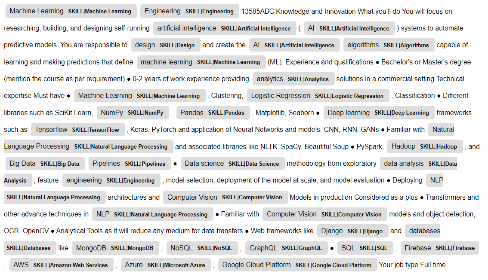

# Resume Scoring and Ranking

## *How can we automate the process of scoring and ranking resumes?*


## 1. Overview

The purpose of this project is to automate the tedious task of manual processing  of CVs by creating a tool that gives a score to a CV based on a given job description. To achieve this goal, the tool will be implemented using a natural language processing approach. A lexicon of skills is first built and the skills are grouped by job to help identify which skills are most unique to a job. Term frequency inverse document frequency (TF-IDF) is used to assign weights for skills. The scoring be done by extracting all the set of relevant skill from the job description and then the resume then mapping the document into a vector space in which each skill identified in the job description is an element. Finally, we can compute skill similarity between the documents by computing cosine similarity between the skills vectors for each document. Consequently, this tool boosts the recruitment process of candidates by identifying the resumes that are the most similar to a specific job description.

The web app can be found [here](https://antoinerahal-resume-scorer-main-rzzew6.streamlitapp.com).

## 2. Business Problem

Curriculum vitae (CVs), also known as resumes, continue to be a crucial standard document and a key decision element in selecting candidates and assessing their experience. Its primary function is to determine applicants' eligibility for a job position. However, corporate companies and recruitment agencies process an increasing number of CVs daily which constitutes a challenge for human recruiters. In fact, they need to spend long hours scrutinizing and analysing these documents by matching the candidates’ s technical and soft skills with that required by the job posts. In addition of being time consuming, the process may be subjective and partial since some recruiters do not follow professional standards in recruiting talent. The challenge emerges in finding the right candidate with the right skills in a short amount of time and without any type of prejudice or stereotyping.

## 3. Data

The data was scraped from [LinkedIn Career Explorer](https://linkedin.github.io/career-explorer/) which is tool that helps people uncover careers they could transition into and might not have considered, by mapping the skills they have to thousands of job titles. The Career Explorer tool leverages the vast amount of data contained in LinkedIn’s professional social media platform and help identify which skills are most vital to a specific job. It uses the aggregated profile information of LinkedIn's 706+ million members around the world.

The data was scraped using Selenium and Beautiful Soup which are Python libraries that support browser automation and HTML and XML documents parsing. The data consists of jobs and their respective skills and it was obtained by web scraping. The first step consisted of building a list of all the available cities available in the LinkedIn Career Explorer, then looping over the cities and then building a list of all the jobs in each city and looping over them to find the different jobs and their respective skills in different cities. For this project, Jobs and their respective skills from around 200 cities were scraped, resulting in around 2300 unique jobs and around 4000 unique skills.

The data was then stored in a MySQL relational database using many-to-many relationship between jobs and skills in addition to CSV format.

### 3.1 Creating a Dataframe of Skills Grouped by Job

A separate dataframe of skills grouped by job is created, this step would help identify which skills are most unique to a job and which skills are common across a wide range of jobs. The first column of the dataframe consist of the name of the job and the second includes a list of comma-separatedskills for a specific job, thus each row represents all the skills relevant to a specific job.

| Column Name | Description |
|-|-|
| job_name | The name of the job position |
| job_skills | A list of all the unique skills relevant to the job position |

### 3.2 Pattern File
We can create a Pattern File by getting the unique set of skills available in our data to extract skills from the CVs and the job description. For this purpose, spaCy can be used to tokenize the text and identify specific entities in the text. The previously built lexicon of skill will be used to do rule-based matching using spaCy’s Entity Ruler which is a component of the spaCy pipeline that allows us to do rule-based entity recognition by letting us add named entities based on a dictionary of patterns. To be more specific, entity patterns dictionaries are dictionaries with two keys: "label", specifying the label to assign to the entity if the pattern is matched, and "pattern", the match pattern. For example, **{"label": "SKILL|Python", "pattern": [{"LOWER": "python"}]}** enablesspaCy to find in the text a token whose lowercase form matches “python”, e.g., “Python”, “PYTHON” or “python”, basically any form of the word “python”.

## 4. Extracting Skills from the Documents

To do this step efficiently, spaCy allows us to load patterns from JSONL (JSON Lines or newline-delimited JSON) files, containing one pattern object per line. We will use the previously created Pattern File.

## 5. Weighting the Skills

In this step, Term frequency inverse document frequency (TF-IDF), a technique commonly used in text mining, is used to assign weights for the skills. TF-IDF is a measure used to evaluate how important a word is to a document in a collection or a corpus.

In this case, the TF-IDF algorithm is used to evaluate how representative a skill is to a selected entity. If a skill is present across a wide range of jobs, the lower the weight of the skill. This is important because a set of generic and commonly held skills should not be weighted the same as the unique skills that are used on a specific job. For example, Microsoft Word and AutoCAD cannot be weighted the same when it comes to an engineering job, it is a skill that is hardly representative of the job position under consideration. Overall, the goal of this is to downweight skills that are common in many jobs and industries.

To weight the skill using TF-IDF, the previously created dataframe of skills grouped by job will be used. The columns of the dataframe consist of the name of the job and the second includes a list of all the unique skills for a specific job, thus each row represents all the skills relevant to a specific job. For this purpose, TfidfVectorizer from Scikit-learn will be fitted on dataframe of skills grouped by job and used to weight the skills. A custom tokenizer will be used for feature extraction allowing us to extract each skill as a feature, this allows us to have a vector space in which each skill is an element with the most unique skills having the highest weights and the most common skills having the lowest weights. After applying the TF-IDF technique, we will have the new weighted skill vector.

| Skill | Number of unique jobs needing the skill | Approximate TF-IDF Weight |
|-|-|-|
| Teamwork	| 438	| 0.1761 |
| Time Management	| 364	| 0.1883 |
| Accounting	| 176 |	0.2362 |
| AutoCAD	| 153 |	0.2454 |
| Linux	| 132	| 0.2551 |
| Forecasting	| 127 |	0.2576 |
| Scrum	| 100	| 0.2733 |
| Financial Modeling | 77	| 0.2904 |
| R (Programming Language) | 35	| 0.3415 |
| Aircraft Maintenance | 8	| 0.4332 |
| Deep Learning	| 4	| 0.4721 |

## 6. Computing the similarity of the Documents

After completing the previous steps, we can now (1) extract the skills from our documents using rule-based entity recognition with the help of spaCy’s Entity Ruler and (2) get a vector of weight for the skills using TfidfVectorizer. Having our skills vectors for the CVs and the job description, the final step consists of computing the similarity between each CVs and the job description. To achieve that objective, a commonly used metric in the literature for measuring document similarity is the Cosine Similarity, it helps determine how similar the documents are irrespective of their size. The reason is that the cosine similarity evaluates the orientation of the vectors and not their magnitude.

In this project, the vectors are arrays containing the weight of the skills available in the CV and the job description. However, it is important to note that our elements (skills) will only be the skillsavailable in the job description because they are the skills of interest and not all the skills available across all documents. This helps avoid creating unnecessary distance between the vector for the job description and the vector for the CV. As a result, we will have the cosine similarity ranging from 0 to 1, since the term frequencies cannot be negative because our weights cannot be negative.


## 7. Outcome

Below we can find the skills identified in a sample job description:



### 7.1 Dealing with skills that should’ve been identified but were not identified

We can also notice that some skills weren’t identified properly when parsing the document, to properly deal with this issue an option for the user will be added for them to select the skill that was not identified and write its corresponding pattern. This simply means that the user will be indirectly provided an option to write the pattern of the skill that needs to be identified and also choose the correct label for the skill among the labels in the lexicon of skills. This way the skill willbe properly identified and assigned the correct weight.

### 7.2 Dealing with skills that did not match properly

As we can see most skills are identified properly, the skills that are not identified are simply not present in our original dataset of skills. We can also notice that some words matched as skills but are not actual skills, in the case of this job description: “Engineering” is not an actual skill, in addition we can see that the verb “design” had been mistaken with the actual skill “design”. To deal with this issue, the user will be given the option to filter out the skills that are not matching properly. 

## 8. Streamlit Web App

The Streamlit web app can be found [here](https://antoinerahal-resume-scorer-main-rzzew6.streamlitapp.com)!

## 9. Next Steps

This approach would help the recruiter accelerate the screening process by filtering out the large pool of candidates. While this method of parsing and scoring CVs hasobvious limitations and personal and technical skills are not the only way to evaluate potential candidates for a job position, using this tool to shortlist thenumber of candidates might save recruiters a considerable amount of time. A next step in this project could be the summarization and extraction of key informationfrom resumes, to provide a quick overview of all the candidates to help recruiters in the selection process. Furthermore, with a properly labeled dataset aneven more efficient and reliable scoring process can be explored in the future.

## Repository Contents
```bash
.
├── data                               # contains data
│   └── my_patterns.jsonl              # patterns file
├── image                              # contains visualizations and local images
├── tfidf                              # contains TFIDF Vectorizer
│   └── tfidf.pkl                      # pickled TFIDF Vectorizer
├── README.md                          # public-facing preview
├── main.py                            # interactive web app to host project
└── requirements.txt                   # app dependencies
```

## For More Information

For additional information or suggestions, contact Antoine Rahal at [antoinerahal1@gmail.com](mailto:antoinerahal1@gmail.com)

**Let's connect!**

<a href="https://www.linkedin.com/in/antoine-rahal/" target="_blank"></a>
